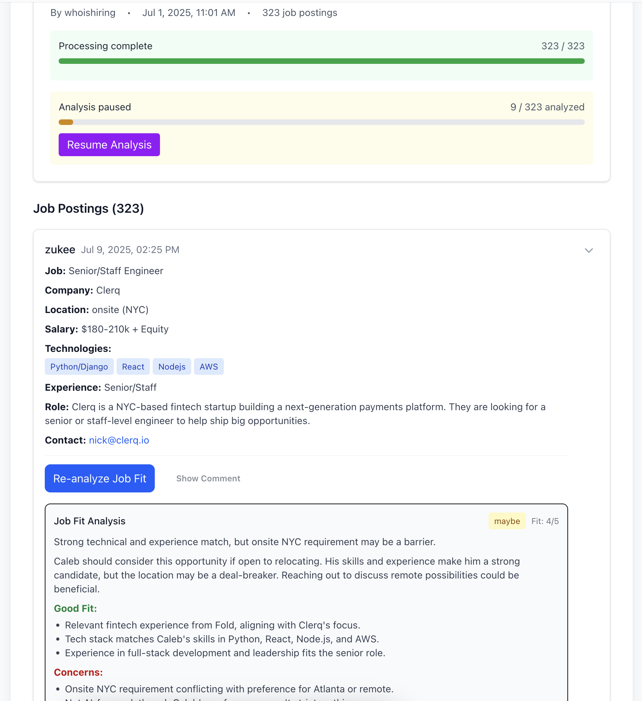

# Jobseekr Project


## Project Structure

This repository contains both the original Python implementation and the new Next.js web application:

- `/python-script/` - Original Python-based job search automation
- `/app/` - Next.js web application with enhanced features

## Python Script (Legacy)

Original implementation using Python for job search automation with local AI models and database persistence. See `/python-script/CLAUDE.md` for details.

## Next.js Web Application (Current)

Production-ready web application with enhanced UI, real-time features, and cloud infrastructure. See `/app/CLAUDE.md` for detailed documentation.

## Quick Start

### Web Application (Recommended)
```bash
cd app
npm install
npm run dev
```

### Python Script (Legacy)
```bash
cd python-script
pip install requests ollama anthropic tqdm peewee
python search.py
```

## Recent Development

The project has evolved from a Python script to a full-featured web application with:
- Enhanced AI analysis with stronger judgment criteria
- Real-time search progress tracking with Supabase
- Comprehensive SearchSession management
- Production-ready deployment infrastructure
- Rich UI with structured job analysis display


Before making any changes to the code:
1. review the existing related code and make sure that you have a solid understanding of the implications of the nature of what you're implementing
2. double check whether the changes you're thinking about making are complete and don't have implications elsewhere in the code (e.g. if you're changing a function signature, make sure that all the places that call it are updated, or if you add a database field, make sure every insertion/update/deletion of that field is updated if necessary)
4. don't make any assumptions about the code or what needs to be done - clarify any questions or hanging threads
5. discuss your implementation plans